# Top Trumps

View the live app [here](https://top-trumps1-6a9a12a49bdc.herokuapp.com/)

This app provides users with a fun online game to play in the python console and allows the user to edit all of the game data.

The app is targeted to people who enjoy a fast and interesting game, especially those who are already familiar with Top Trumps.

Top Trumps is a classic card game for two players, where the aim of the game is to be the player holding all of the cards. More information about the gameplay is provided in the app itself, and on [Wikipedia](https://en.wikipedia.org/wiki/Top_Trumps)

## User Expectations

- The app should be easy to navigate and all game information displayed intelligently.
- The user should be able to edit the card data used in the game.
- The app should be fully tested and run without bugs.

## Flow Charts

The main menu gives the user the choice to either play a game, or edit the data. The flow of each branch of the app is displayed below.

### Gameplay Flow
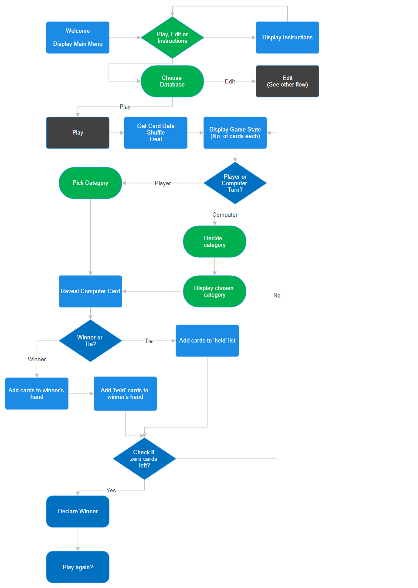

### Data Editing Flow
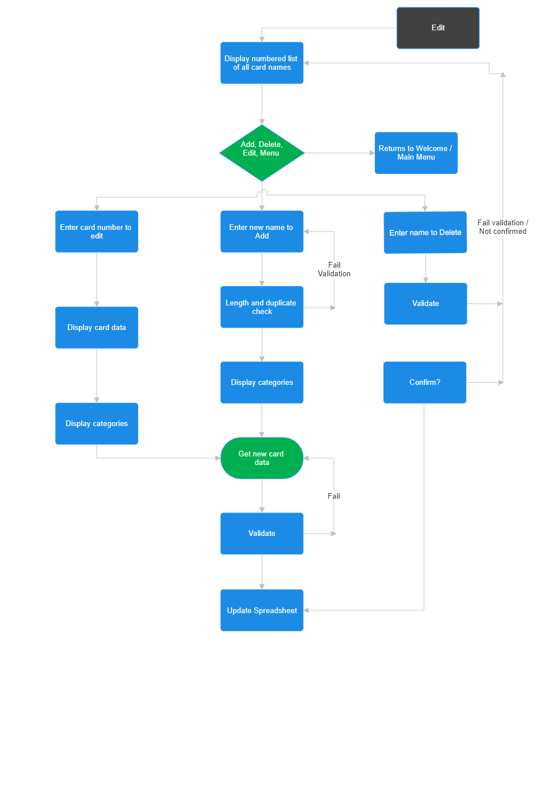

## Features

### Main Menu 
The app starts with a welcome message and immediately presents the user with the main game options. Play, Edit or View instructions. 

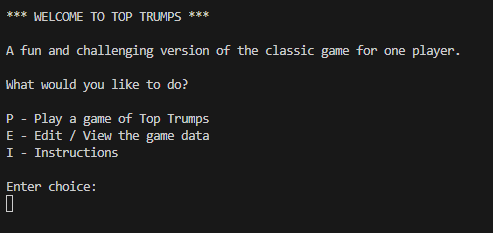

### Instructions
From the Main Menu the user can choose to view the instructions, printed to the terminal.
For readability reasons, the instructions are split into sections and the user must press any key to move to the next page. 

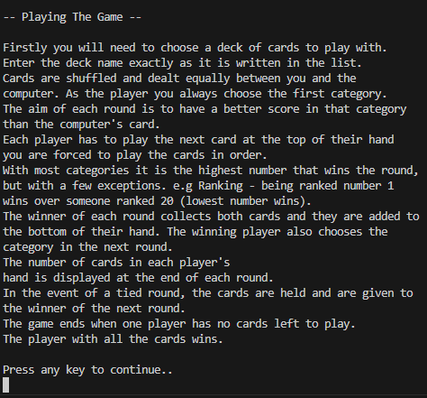

### Choose Deck
The game data is stored in a Google sheets document and the user is presented with a list of decks to use. Each worksheet represents a deck of cards. 
 
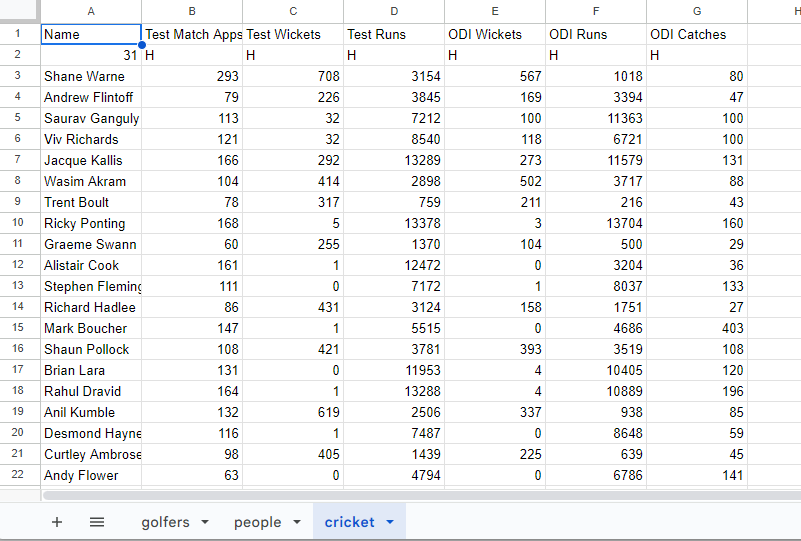  

The data is pulled from the worksheets and presented to the user in the terminal. 

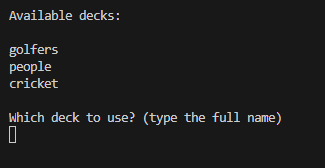 

### Game State
The terminal displays the number of cards each player has in their hand at the start of each round. This shows the user who is winning the game. I used the PrettyTable library to present this information to the user in a clear way. 
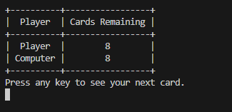

### Card Display
I chose to use the PrettyTable library as a way of displaying the card information to the user in the terminal. This allows the card data to be viewed in a convenient way, with the categories and card data clearly separated. First the player’s card is shown to the player, and then the computer’s card is shown together so the comparison can be made. 

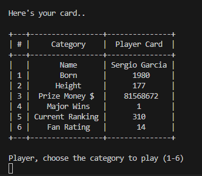  

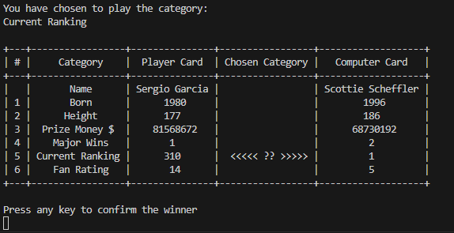

### Editing
 With the chosen deck, a list of all cards is displayed to the user in the terminal before the editing options are given. This confirms to the user which cards are available in the deck.  
 
 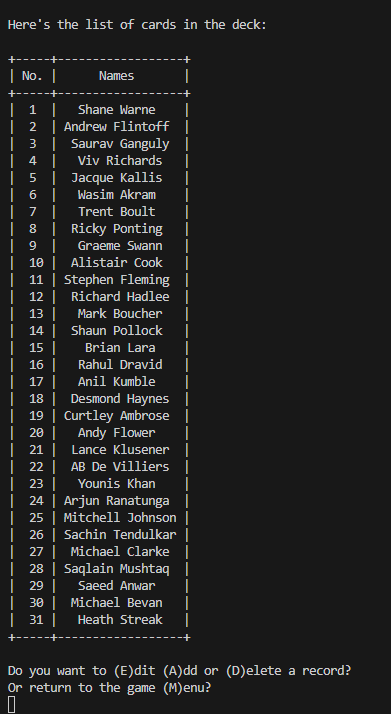

## Technologies Used
 
- Python: Used for all program code.
- GitHub: Used to store the code online, version control and for deployment.
- Gitpod: Used for development as a cloud IDE.
- Heroku: Used to deploy the project.
- Smartdraw: Used to create flowcharts for the Readme file  (https://app.smartdraw.com/)
- CI - Python Linter: Used to validate Python code. (https://pep8ci.herokuapp.com/)
- Google Sheets: Used to maintain the game data
- Google Cloud: For the API between the console and Google Sheets

### Python Libraries

Gspread - for working with Google Sheets
PrettyTable - used to display the game data in table format in the console
  
## Testing
 
### Validator Testing
 
I used Code Institute’s Python Linter to validate the Python code. There are no errors found in my code 

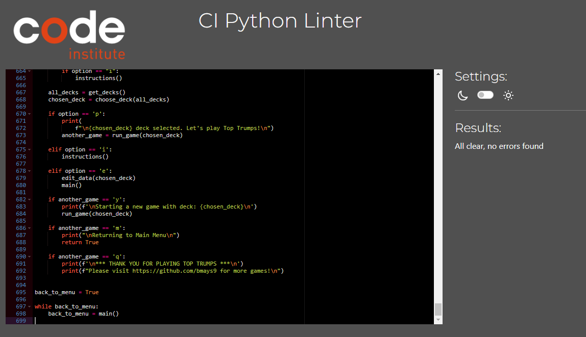

### Manual Testing

<table>
<thead>
  <tr>
    <th>Test Case</th>
    <th>Actual Result</th>
    <th>Pass / Fail</th>
  </tr>
</thead>
<tbody>
  <tr>
    <td>Application loads without any error messages</td>
    <td>No error messages</td>
    <td>Pass</td>
  </tr>
  <tr>
    <td>Main Menu is displayed and awaits user input.</td>
    <td>Welcome message and main menu are displayed and the terminal is waiting for user input</td>
    <td>Pass</td>
  </tr>
  <tr>
    <td>Main menu input is validated correctly</td>
    <td>Incorrect input is relayed to the user and prompted to enter again</td>
    <td>Pass</td>
  </tr>
  <tr>
    <td>Main menu accepts both upper and lowercase valid characters</td>
    <td>All values I, i, p, P, e, E are accepted</td>
    <td>Pass</td>
  </tr>  
  <tr>
    <td>Players are dealt the same number of cards when the deck has an odd number of cards</td>
    <td>A deck was created with an odd number of cards, and the last card was removed after the shuffle. Players were dealt equal number of cards.</td>
    <td>Pass</td>
  </tr>
  <tr>
    <td>Player is able to choose category</td>
    <td>Input is correctly validated and only values 1-6 are possible</td>
    <td>Pass</td>
  </tr>
  <tr>
    <td>Computer chooses a category at random</td>
    <td>All category values have been observed as computer selections.</td>
    <td>Pass</td>
  </tr>
  <tr>
    <td>Winner of the round is correctly determined</td>
    <td>Testing successful with both High and Low value winning criteria. Correct result is printed to the terminal. </td>
    <td>Pass</td>
  </tr>
  <tr>
    <td>Winner gets the cards and chooses the next category</td>
    <td>Tested for both player and computer wins. Cards are added to the bottom of the hand.</td>
    <td>Pass</td>
  </tr>
  <tr>
    <td>In a tied round neither player gets the cards</td>
    <td>Created many cards with the same values to test this extensively. Game state correctly displays the number of cards held after a tie.</td>
    <td>Pass</td>
  </tr>
  <tr>
    <td>The next winner after a tied round gets the previously held cards</td>
    <td>The right cards are held, and then after an eventual winner are assigned correctly to the winner.</td>
    <td>Pass</td>
  </tr>
  <tr>
    <td>When one player has no cards left, the game ends and a winner declared</td>
    <td>The right winner is declared when one player has no cards left to play</td>
    <td>Pass</td>
  </tr>
  <tr>
    <td>Editing Menu input options are validated correctly</td>
    <td>Only expected values in upper or lower case are accepted as input.</td>
    <td>Pass</td>
  </tr>
  <tr>
    <td>When Adding card, new details are validated correctly</td>
    <td>Any deviation from the required format results in an error displayed to the user, and they are prompted to re-enter.</td>
    <td>Pass</td>
  </tr>
  <tr>
    <td>When Editing a card, the new details are validated correctly</td>
    <td>Any deviation from the required format results in an error displayed to the user, and they are prompted to re-enter</td>
    <td>Pass</td>
  </tr>
  <tr>
    <td>When deleting a record, user confirmation is required</td>
    <td>Only entering a Y or y confirms the deletion. Any other key returns to the menu</td>
    <td>Pass</td>
  </tr>
  <tr>
    <td>After any card edit action, the worksheet is updated correctly</td>
    <td>All worksheets are updated correctly after a user action to add, delete or edit a card</td>
    <td>Pass</td>
  </tr>
  <tr>
    <td>After any card edit, the user is presented with an updated list of card names</td>
    <td>The list of card names is retrieved from the worksheet after an edit, and printed to the terminal</td>
    <td>Pass</td>
  </tr>
  <tr>
    <td>After editing, the user can return to the main menu</td>
    <td>Console returns to the main menu</td>
    <td>Pass</td>
  </tr>
  </tbody>
  </table>

## Bugs and Fixes

When entering the database name wrong once, and then correctly. The terminal displayed an error.
The previous code was calling the function again after an invalid input. 
To correct this I adjusted the loop controlling the input and validation so that any number of incorrect entries would not call the function again, and a valid response is always accepted. 

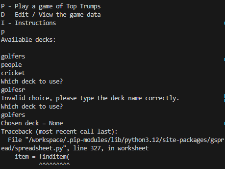

In the golfers deck, the prize money values in the spreadsheet was formatted with commas e.g. 123,456,789. This caused an error when the program tried to determine the winner. 
As this format of entry would fail validation when adding or editing a card in the app, the solution was to reformat the data in the spreadsheet.

When testing the logic for tied rounds (both cards have the same value), the list of held cards was not emptying after being allocated to the next winning player. The cards were assigned to the player, but the cards also remained in the held list.
The solution was to correctly return an empty list from the function to reflect that no cards were being held.

When Validating the code, the CI Python Linter tool produced an error as shown below

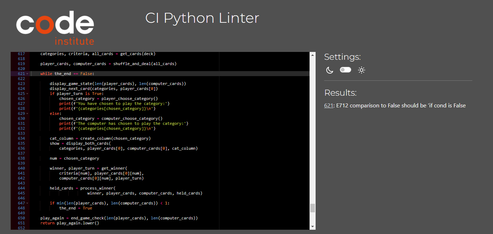

Whilst the program was still running without errors, I changed the line of code from "while the_end == false" to "while the_end is false" which cleared the error from the linter. 

## Deployment

### How to deploy the project

1. Go to [Heroku](https://id.heroku.com/login), create account if you don't have and log in.

2. Head to your dashboard and click "New", then "Create new app"

3. Next step is to give your app a name and to choose region. After that click on "Create app".

4. After that head to "Settings" tab which you can find on top of your Heroku page and under the "Config Vars" set your Key/Value Pairs.

5. Then in the "Buildpacks" section you will need to add buildpacks. Pay attention to the order in which you add buildpacks you need. In my case I had to add Python first and nodejs second.

6. First add "Python", by clicking on Python icon and then click on "Add Buildpack".

7. Then add "nodejs", by clicking on nodejs icon and then click on "Add Buildpack".

8. Then head to "Deployment" tab which you can also find on top of your Heroku page and under "Deployment method" click on "GitHub"(in my case that's where my repository is).

9. After that, just under the "Deployment method" section is "Connect to GitHub" section where you need to find your repository and then click on "Connect".

10. Just under "Connect to GitHub" section is "Automatic deploys" section where you can click on "Enable Automatic Deploys" if that's what you want and just under is "Manual Deploy" section, where you need to click on "Deploy Manually".

### How to clone the project

1. Log into Github
2. Go to the project repository at (https://github.com/bmays9/top-trumps)
3. Click on the Code button and copy your preferred link.
4. Open the terminal in your code editor and change the working directory to the location you want to use for the cloned directory.
5. Type 'git clone' into the terminal, paste the link you copied and hit enter.

### How to fork the repository

1. Login to Github.
2. Go to the project repository at (https://github.com/bmays9/top-trumps)
3. Click the 'Fork' button.

## Credits and References

- For information on using PrettyTable python library:
https://pypi.org/project/prettytable/

- For information on usage of Gspread python library:
https://docs.gspread.org/en/latest/

- To get a list of worksheet names from a Google sheet:
https://stackoverflow.com/questions/67388393/get-list-of-all-google-sheets-using-gspread

- For validation of a user input of 6 integers separated by a comma:
Code Institute Love Sandwiches project.

- For the process of creating the API, the encryption key and using Google Cloud: 
Code Institute Love Sandwiches project.

- For help and guidance on the Readme file
https://github.com/AleksandarJavorovic/coders-parkhouse/blob/main/README.md

- Thanks as always to my mentor Harry Dhillon for his support and advice which is always so valuable and very much appreciated in these projects